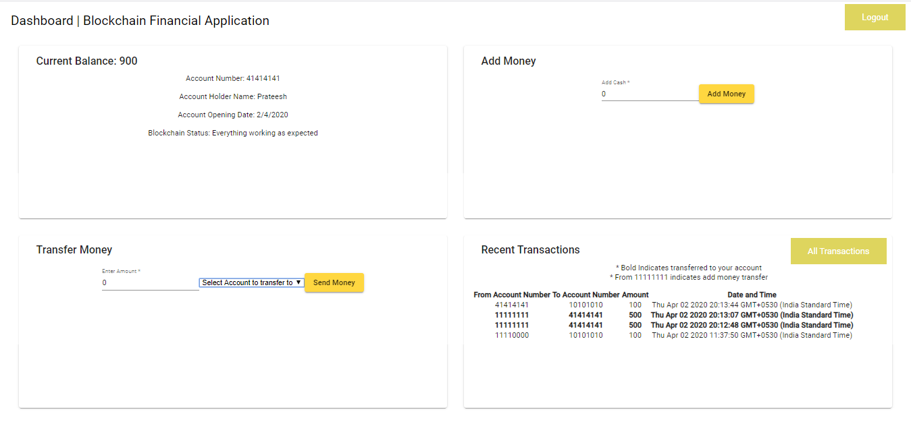

# blockchain-finance

This project is Capstone project for my final year Bachelor's degree in Computer Science at Gandhi Institute of Technology and Management, India

This project was generated with [Angular CLI](https://github.com/angular/angular-cli) version 8.3.21.

It is inspired by and a practical implementation of the paper [Research of a Possibility of Using Blockchain Technology without Tokens to Protect Banking Transactions](https://ieeexplore.ieee.org/document/8657279)

## Development

Run `ng generate component component-name` to generate a new component. You can also use `ng generate directive|pipe|service|class|guard|interface|enum|module`.

Run `ng build` to build the project. The build artifacts will be stored in the `dist/` directory. Use the `--prod` flag for a production build.

## Testing

### Running unit tests

Run `ng test` to execute the unit tests via [Karma](https://karma-runner.github.io).

### Running end-to-end tests

Run `ng e2e` to execute the end-to-end tests via [Protractor](http://www.protractortest.org/).

## Dashboard 

User Login [Dashboard](https://blockchain-finance.firebaseapp.com/login) to add money or transfer money to other users.

[Contact me](https://prateeshreddy007.wixsite.com/mysite/contact) or connect with me on [Linkedin](https://www.linkedin.com/in/prateeshreddy) to get Login Credentials for the dashboard if u want to play around with the Project.

Also Database showing all transactions with columns 
From Account, To Account,	Amount,	Date of Transaction, Transaction ID, Current Hash and Previous Hash. 

This Project is unique as it is uses blockchain to authenticate transactions by checking if prev hash is equal to current hash.

If any hacker tries to interupt these transactions our dashboard gives pop-up showing Blockchain tampered.

## Citation

N. A. Popova and N. G. Butakova, [Research of a Possibility of Using Blockchain Technology without Tokens to Protect Banking Transactions](https://ieeexplore.ieee.org/document/8657279) 2019 IEEE Conference of Russian Young Researchers in Electrical and Electronic Engineering (EIConRus), St.Petersburg and Moscow, Russia, 2019, pp. 1764-1768.

